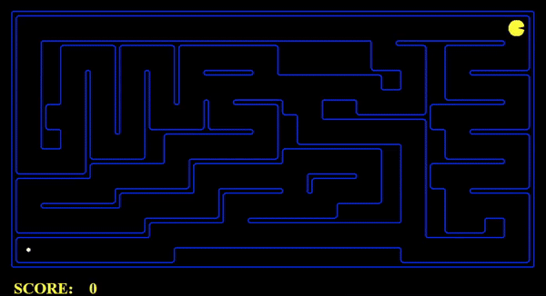
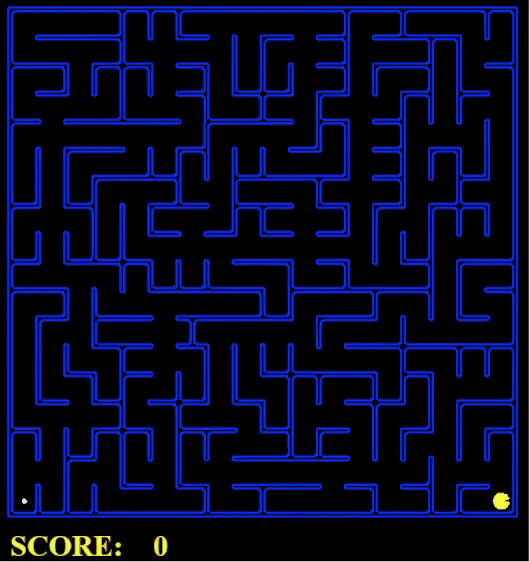
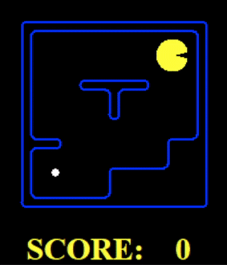
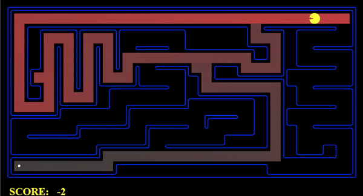
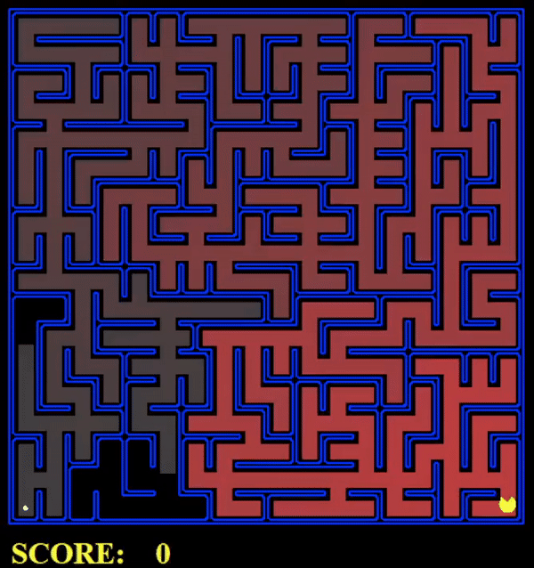
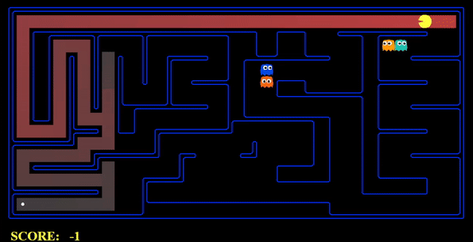

# CSC460-Project


# Project – Phase 1

Table of Content:

- [Q1: Depth First Search](#Q1:-Depth-First-Search)
- [Q2: Breadth First Search](#Q2:-Breadth-First-Search)
- [Q3: Uniform Cost Search](#Q3:-Varying-the-Cost-Function)
- [Q4: A* Search](#A*-search)
- Q5: Corners Problem: Representation
- Q6: Corners Problem: Heuristic
- Q7: Eating All The Dots: Heuristic
- Q8: Suboptimal Search


# **Q1: Depth First Search**

### **DFS tiny Maze**
---
```
python pacman.py -l tinyMaze -p SearchAgent
```


```
Path found with total cost of 10 in 0.0 seconds
Search nodes expanded: 15
Pacman emerges victorious! Score: 500
```
------


### **DFS Medium Maze**
---

```
pacman.py -l mediumMaze -p SearchAgent
```


```
Path found with total cost of 130 in 0.0 seconds
Search nodes expanded: 146
Pacman emerges victorious! Score: 380
```

- The solution found by DFS here is not the least cost solution. Depth-first search is prone to finding a solution quickly but may not necessarily find the shortest solution.

- Depth-first search explores a path as far as possible before backtracking, which means it may explore a long path that ultimately doesn't lead to the goal state. Therefore, DFS may find a solution that is not optimal or least cost.

- To ensure that DFS finds the optimal solution, we can modify the algorithm by keeping track of the cost of each path explored and selecting the path with the lowest cost at each step. This modification would turn DFS into an informed search algorithm, such as Uniform Cost Search or A* Search.
------------
### **DFS Big Maze**
---
```
python pacman.py -l bigMaze -z .5 -p SearchAgent
```



```
Path found with total cost of 210 in 0.0 seconds
Search nodes expanded: 390
Pacman emerges victorious! Score: 300
```

- The exploration order displayed on the Pacman board may or may not be what we expect, depending on the specific algorithm being used and the structure of the maze.
  

- DFS explores a path as far as possible before backtracking, so the exploration order displayed on the Pacman board during the search reflects the order in which the algorithm explores the stack.

- Pacman does not actually go to all the explored squares on his way to the goal, and the purpose of displaying the exploration order on the Pacman board is to help us understand how the search algorithm is exploring the state space.

--------

# **Q2: Breadth First Search**

### **BFS Small Maze**
------

```
python pacman.py -l smallMaze -p SearchAgent -a fn=bfs
```



```
Path found with total cost of 8 in 0.0 seconds
Search nodes expanded: 15
Pacman emerges victorious! Score: 502
```
-------------

### **BFS Medium Maze**
-------
```
python pacman.py -l mediumMaze -p SearchAgent -a fn=bfs
```


```
Path found with total cost of 68 in 0.0 seconds
Search nodes expanded: 269
Pacman emerges victorious! Score: 442
```
----
### **BFS Big Maze**
-----
```
python pacman.py -l bigMaze -p SearchAgent -a fn=bfs
```



```
Path found with total cost of 210 in 0.0 seconds
Search nodes expanded: 620
Pacman emerges victorious! Score: 300
```
--------
# **Q3: Varying the Cost Function**


### **UCS Medium Maze**
---
```
python pacman.py -l mediumMaze -p SearchAgent -a fn=ucs
```


```
Path found with total cost of 68 in 0.5 seconds
Search nodes expanded: 269
Pacman emerges victorious! Score: 442
```
--------

### **UCS Medium Dotted Maze**
-----
```
python pacman.py -l mediumDottedMaze -p StayEastSearchAgent
```


```
Path found with total cost of 1 in 0.5 seconds
Search nodes expanded: 186
Pacman emerges victorious! Score: 646
```
---

### **UCS Medium Scary Maze**

-------

```
python pacman.py -l mediumScaryMaze -p StayWestSearchAgent
```



```
Path found with total cost of 68719479864 in 0.5 seconds
Search nodes expanded: 98
Pacman emerges victorious! Score: 418
```

---

### **UCS Big Maze**

---------

```
python pacman.py -l bigMaze -p SearchAgent -a fn=ucs -z .5
```


```
Path found with total cost of 210 in 0.0 seconds
Search nodes expanded: 620
Pacman emerges victorious! Score: 300
```
---
# **Q4: A\* search**


### **A\* Medium Maze**
-------
```
python pacman.py -l mediumMaze -z .5 -p SearchAgent -a fn=astar,heuristic=manhattanHeuristic
```


```
Path found with total cost of 74 in 0.0 seconds
Search nodes expanded: 78
Pacman emerges victorious! Score: 436
```
---------
### **A\* Big Maze**
--------

```
python pacman.py -l bigMaze -z .5 -p SearchAgent -a fn=astar,heuristic=manhattanHeuristic
```


```
Path found with total cost of 210 in 0.0 seconds
Search nodes expanded: 466
Pacman emerges victorious! Score: 300
```
---