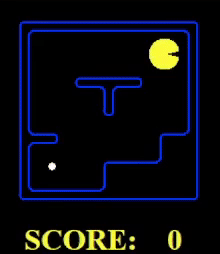

# CSC460-Project


# Project – Phase 1

Table of Content:
- Introduction
- Q1: Depth First Search
- Q2: Breadth First Search
- Q3: Uniform Cost Search
- Q4: A* Search
- Q5: Corners Problem: Representation
- Q6: Corners Problem: Heuristic
- Q7: Eating All The Dots: Heuristic
- Q8: Suboptimal Search


## Introduction


# Q1: Finding Fixed Food Dot using Depth First Search


## DFS Small Maze
------------
```
python pacman.py -l tinyMaze -p SearchAgent
```



```
Path found with total cost of 10 in 0.0 seconds
Search nodes expanded: 15
Pacman emerges victorious! Score: 500
```


## DFS Medium Maze
-----------
```
pacman.py -l mediumMaze -p SearchAgent
```


```
Path found with total cost of 130 in 0.0 seconds
Search nodes expanded: 146
Pacman emerges victorious! Score: 380
```

The solution found by DFS here is not the least cost solution. Depth-first search is prone to finding a solution quickly but may not necessarily find the shortest solution.

Depth-first search explores a path as far as possible before backtracking, which means it may explore a long path that ultimately doesn't lead to the goal state. Therefore, DFS may find a solution that is not optimal or least cost.

To ensure that DFS finds the optimal solution, we can modify the algorithm by keeping track of the cost of each path explored and selecting the path with the lowest cost at each step. This modification would turn DFS into an informed search algorithm, such as Uniform Cost Search or A* Search.

## DFS Big Maze
```
python pacman.py -l bigMaze -z .5 -p SearchAgent
```


```
Path found with total cost of 210 in 0.0 seconds
Search nodes expanded: 390
Pacman emerges victorious! Score: 300
```


