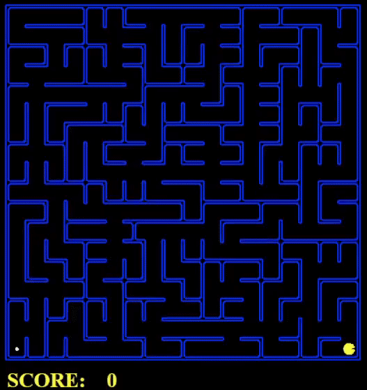

# CSC460-Project


# Project – Phase 1

Table of Content:
- Introduction
- Q1: Depth First Search
- Q2: Breadth First Search
- Q3: Uniform Cost Search
- Q4: A* Search
- Q5: Corners Problem: Representation
- Q6: Corners Problem: Heuristic
- Q7: Eating All The Dots: Heuristic
- Q8: Suboptimal Search


## Introduction


## Q1: Finding Fixed Food Dot using Depth First Search

```
python pacman.py -l tinyMaze -p SearchAgent
```


