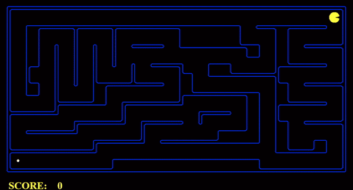

# CSC460-Project


# Project – Phase 1

Table of Contents:
- [CSC460-Project](#csc460-project)
- [Project – Phase 1](#project--phase-1)
- [**Q1: Depth First Search**](#q1-depth-first-search)
    - [**DFS tiny Maze**](#dfs-tiny-maze)
    - [**DFS Medium Maze**](#dfs-medium-maze)
    - [**DFS Big Maze**](#dfs-big-maze)
    - [**DFS Open Maze**](#dfs-open-maze)
- [**Q2: Breadth First Search**](#q2-breadth-first-search)
    - [**BFS Tiny Maze**](#bfs-tiny-maze)
    - [**BFS Medium Maze**](#bfs-medium-maze)
    - [**BFS Big Maze**](#bfs-big-maze)
    - [**BFS Open Maze**](#bfs-open-maze)
- [**Q3: Varying the Cost Function**](#q3-varying-the-cost-function)
    - [**UCS Medium Maze**](#ucs-medium-maze)
    - [**UCS Medium Dotted Maze**](#ucs-medium-dotted-maze)
    - [**UCS Medium Scary Maze**](#ucs-medium-scary-maze)
    - [**UCS Big Maze**](#ucs-big-maze)
    - [**UCS Open Maze**](#ucs-open-maze)
- [**Q4: A\* search**](#q4-a-search)
    - [**A\* Medium Maze**](#a-medium-maze)
    - [**A\* Big Maze**](#a-big-maze)
    - [**A\* Open Maze**](#a-open-maze)
- [**Comparison Table**](#comparison-table)


# **Q1: Depth First Search**

### **DFS tiny Maze**
---
```
python pacman.py -l tinyMaze -p SearchAgent
```


```
Path found with total cost of 10 in 0.0 seconds
Search nodes expanded: 15
Pacman emerges victorious! Score: 500
```
------


### **DFS Medium Maze**
---

```
pacman.py -l mediumMaze -p SearchAgent
```


```
Path found with total cost of 130 in 0.0 seconds
Search nodes expanded: 146
Pacman emerges victorious! Score: 380
```

- The solution found by DFS here is not the least cost solution. Depth-first search is prone to finding a solution quickly but may not necessarily find the shortest solution.

- Depth-first search explores a path as far as possible before backtracking, which means it may explore a long path that ultimately doesn't lead to the goal state. Therefore, DFS may find a solution that is not optimal or least cost.

- To ensure that DFS finds the optimal solution, we can modify the algorithm by keeping track of the cost of each path explored and selecting the path with the lowest cost at each step. This modification would turn DFS into an informed search algorithm, such as Uniform Cost Search or A* Search.
------------
### **DFS Big Maze**
---
```
python pacman.py -l bigMaze -z .5 -p SearchAgent
```


```
Path found with total cost of 210 in 0.0 seconds
Search nodes expanded: 390
Pacman emerges victorious! Score: 300
```

- The exploration order displayed on the Pacman board may or may not be what we expect, depending on the specific algorithm being used and the structure of the maze.
  

- DFS explores a path as far as possible before backtracking, so the exploration order displayed on the Pacman board during the search reflects the order in which the algorithm explores the stack.

- Pacman does not actually go to all the explored squares on his way to the goal, and the purpose of displaying the exploration order on the Pacman board is to help us understand how the search algorithm is exploring the state space.

--------

### **DFS Open Maze**
------
```
python pacman.py -l openMaze -p SearchAgent
```


```
Path found with total cost of 298 in 0.0 seconds
Search nodes expanded: 576
Pacman emerges victorious! Score: 212
```
-----


# **Q2: Breadth First Search**

### **BFS Tiny Maze**
------

```
python pacman.py -l tinyMaze -p SearchAgent -a fn=bfs
```


```
Path found with total cost of 8 in 0.0 seconds
Search nodes expanded: 15
Pacman emerges victorious! Score: 502
```
-------------

### **BFS Medium Maze**
-------
```
python pacman.py -l mediumMaze -p SearchAgent -a fn=bfs
```


```
Path found with total cost of 68 in 0.0 seconds
Search nodes expanded: 269
Pacman emerges victorious! Score: 442
```
----
### **BFS Big Maze**
-----
```
python pacman.py -l bigMaze -p SearchAgent -a fn=bfs
```


```
Path found with total cost of 210 in 0.0 seconds
Search nodes expanded: 620
Pacman emerges victorious! Score: 300
```
--------

### **BFS Open Maze**
-----

```
python pacman.py -l openMaze -p SearchAgent -a fn=bfs
```


```
Path found with total cost of 54 in 0.1 seconds
Search nodes expanded: 682
Pacman emerges victorious! Score: 456
```
---
# **Q3: Varying the Cost Function**


### **UCS Medium Maze**
---
```
python pacman.py -l mediumMaze -p SearchAgent -a fn=ucs
```


```
Path found with total cost of 68 in 0.5 seconds
Search nodes expanded: 269
Pacman emerges victorious! Score: 442
```
--------

### **UCS Medium Dotted Maze**
-----
```
python pacman.py -l mediumDottedMaze -p StayEastSearchAgent
```


```
Path found with total cost of 1 in 0.5 seconds
Search nodes expanded: 186
Pacman emerges victorious! Score: 646
```
---

### **UCS Medium Scary Maze**

-------

```
python pacman.py -l mediumScaryMaze -p StayWestSearchAgent
```


```
Path found with total cost of 68719479864 in 0.5 seconds
Search nodes expanded: 98
Pacman emerges victorious! Score: 418
```

---

### **UCS Big Maze**

---------

```
python pacman.py -l bigMaze -p SearchAgent -a fn=ucs -z .5
```


```
Path found with total cost of 210 in 0.0 seconds
Search nodes expanded: 620
Pacman emerges victorious! Score: 300
```
---

### **UCS Open Maze**
-----

```
python pacman.py -l openMaze -p SearchAgent -a fn=ucs
```


```
Path found with total cost of 54 in 0.1 seconds
Search nodes expanded: 682
Pacman emerges victorious! Score: 456
```
---


# **Q4: A\* search**


### **A\* Medium Maze**
-------
```
python pacman.py -l mediumMaze -z .5 -p SearchAgent -a fn=astar,heuristic=manhattanHeuristic
```


```
Path found with total cost of 68 in 0.0 seconds
Search nodes expanded: 221
Pacman emerges victorious! Score: 442
```
---------
### **A\* Big Maze**
--------

```
python pacman.py -l bigMaze -z .5 -p SearchAgent -a fn=astar,heuristic=manhattanHeuristic
```


```
Path found with total cost of 210 in 0.0 seconds
Search nodes expanded: 549
Pacman emerges victorious! Score: 300
```
---


### **A\* Open Maze**
---
```
python pacman.py -l openMaze -p SearchAgent -a fn=astar,heuristic=manhattanHeuristic
```


```
Path found with total cost of 54 in 0.0 seconds
Search nodes expanded: 535
Pacman emerges victorious! Score: 456
```


# **Comparison Table**

|Maze | Algorithm|Cost|Score|Nodes Expanded
|-----------|---------|----|-----|----|
|Tiny   |DFS|10| 500 |15|
|       |BFS|9|502|15|
|Medium|DFS|130|380|146|
||BFS|68|442|269|
||UCS|68|442|269|
||A*|68|422|221|
|Big|DFS|210|300|390|
||BFS|300|300|620|
||UCS|300|300|620|
||A*|210|300|549|
|Open|DFS|298|212|576|
||BFS|54|456|682|
||UCS|54|456|682|
||A*|54|456|535|

